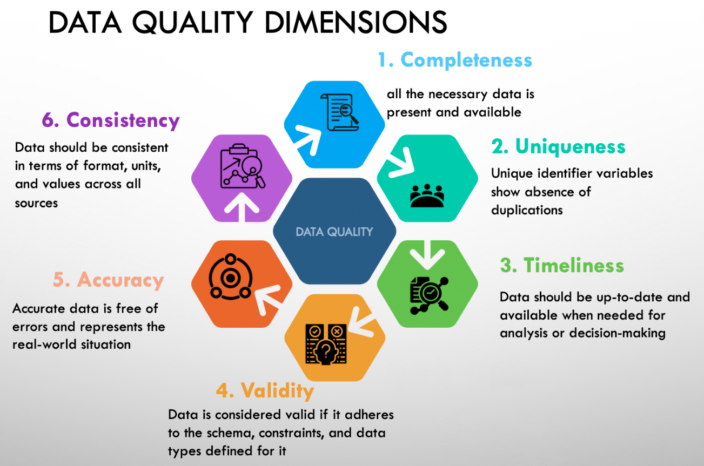

# Data Quality
_Это репозиторий для хранения заметок и кода моих задач по качеству данных._

> **Качество данных** — это набор характеристик, определяющих свойства и пригодность данных для их использования.

### Измерения качества данных:
- **Completeness** (Полнота) — *не должно быть пропущенных данных.*
- **Validity** (Достоверность) — *данные должны соответствовать определенному формату.*
- **Accuracy** (Точность) — *в данных не должно быть ошибок.*
- **Consistency** (Согласованность) — *значения данных не должны конфликтовать с другими значениями в наборах данных.*
- **Uniqueness** (Уникальность) — *не должно быть дубликатов.*
- **Timeliness** (Своевременность) — *данные должны быть актуальными.*

### Инструменты обеспечения качества данных
[Great Expectations](great_expectations/readme.md)