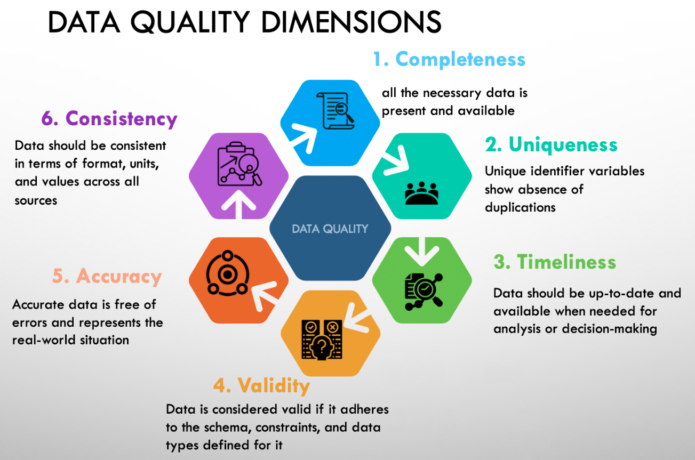

# Data Quality

### [Назад к Содержанию ⤶](https://github.com/adrianhel/contents)

>_Репозиторий для хранения заметок и кода задач по качеству данных._

**Качество данных** — это набор характеристик, определяющих свойства и пригодность данных для их использования.

### Измерения качества данных
- **Completeness** (Полнота) – *не должно быть пропущенных данных.*
- **Uniqueness** (Уникальность) – *не должно быть дубликатов.*
- **Timeliness** (Своевременность) – *данные должны быть актуальными.*
- **Validity** (Достоверность) – *данные должны соответствовать определенному формату.*
- **Accuracy** (Точность) – *в данных не должно быть ошибок.*
- **Consistency** (Согласованность) – *значения данных не должны конфликтовать с другими значениями в наборах данных.*

### Основные проблемы с качеством данных
- Пропущенные значения
- Дублирование записей
- Устаревшие данные
- Ошибки ввода
- Несогласованность форматов

## Инструменты обеспечения качества данных
**Библиотека [Great Expectations](great_expectations/readme.md)**

